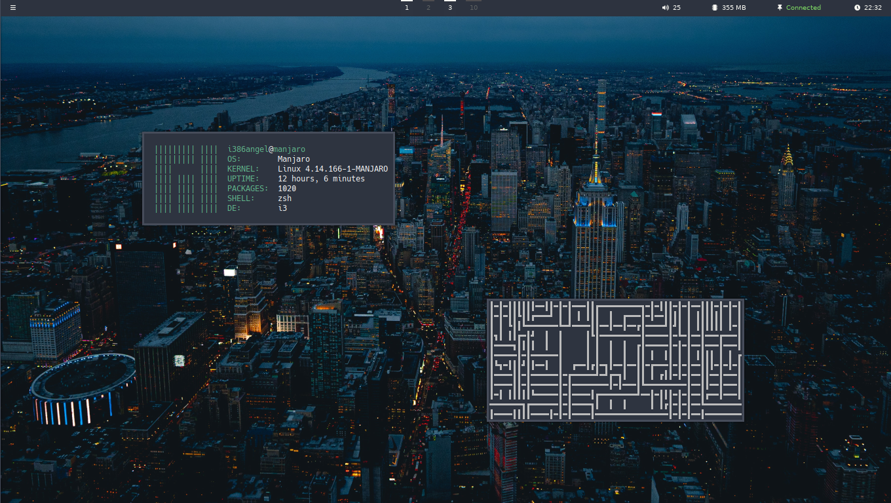

# My i3wm config files
##### by i386angel

 

___

### What i need?

___

> **rofi** (to launch apps)

> **xfce4-terminal** (terminal)

> **i3-gaps** (to get margin window)

> **compton** (composer)

> **polybar** (the bar)

> **xfce4-screenshooter** (print with function key PrintScreen)

> **nitrogen** (wallpaper set)

> **ProtonVPN** (if you use NordVPN you need to edit script file. if don't use VPN, remove module from bar in the config file)

___
 
___

#### Exemple:

___
